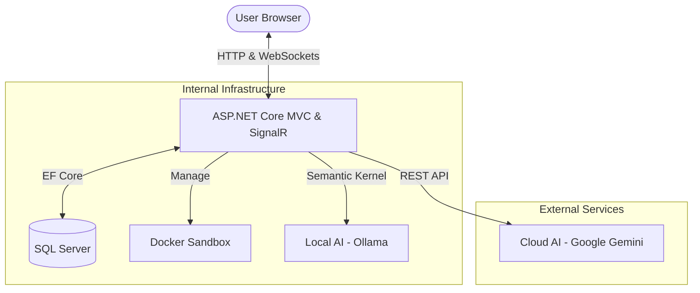
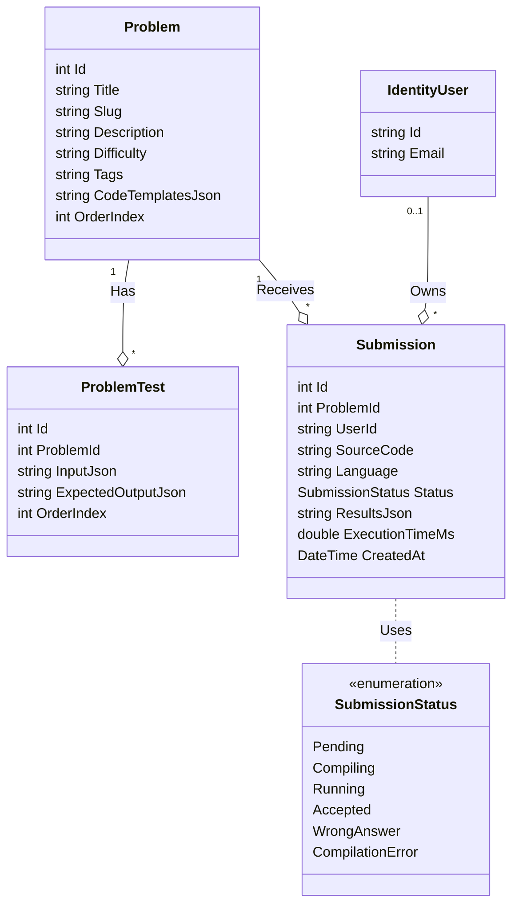

# System Architecture & Workflows: JustBigO-Fun

This document fulfills the requirement for Part B (Diagrams) of the MDS project.

## 1. High-Level System Architecture (Hybrid AI)

The platform utilizes a hybrid AI architecture, combining local LLM processing for privacy-sensitive tasks with cloud-based AI for analysis.

## 2. AI Code Translation Workflow (Autonomous Reflexion)

This sequence describes the autonomous "Reflexion" strategy where the system self-corrects code errors using a local LLM and sandbox testing.

```mermaid
sequenceDiagram
    autonumber
    participant U as User (UI)
    participant H as TranslationHub
    participant A as Translator Agent
    participant K as Kernel (LLM)
    participant D as Docker Sandbox

    U->>H: TranslateCode(src, target)
    H->>A: TranslateWithReflexionAsync()
    
    loop Max 5 Attempts
        A->>K: InvokePromptAsync
        K-->>A: Drafted Code
        
        rect rgb(30, 30, 40)
            Note over A,D: Validation Phase
            A->>D: TestRawCodeAsync
            D-->>A: Result (Success/Failure)
        end
        
        alt Failure
            A->>A: Append Compiler Error to Prompt
        else Success
            Note over A: Break Loop
        end
    end

    A-->>H: Validated Code (or Error)
    H-->>U: ReceiveCodeChunk(Final Code)
```

## 3. Core Database Schema (UML)

## 4. Submission Evaluation Workflow

This diagram illustrates the lifecycle of a code submission from the API request to isolated execution.

```mermaid
sequenceDiagram
    autonumber
    participant U as User (UI)
    participant C as SubmissionController
    participant DB as SQL Server
    participant E as DockerCodeExecutor
    participant D as Docker Sandbox

    U->>C: POST /api/submission
    C->>DB: Save Submission (Pending)
    C-->>U: Return SubmissionID
    
    Note over C,E: Background Execution
    C->>E: ExecuteAsync(id)
    E->>DB: Update Status (Running)
    
    rect rgb(30, 30, 40)
        Note over E,D: Docker Sandbox Isolation
        E->>E: Prepare WorkDir
        E->>D: Docker Run (Compile)
        D-->>E: Result
    end
    
    alt Compilation Error
        E->>DB: Update Status (CompilationError)
    else Success
        loop Each ProblemTest
            E->>D: Docker Run (Execute)
            D-->>E: Output / Exit Code
            E->>E: Map Result
        end
        E->>DB: Final Status & ResultsJson
    end
    
    E->>E: Cleanup WorkDir
```

