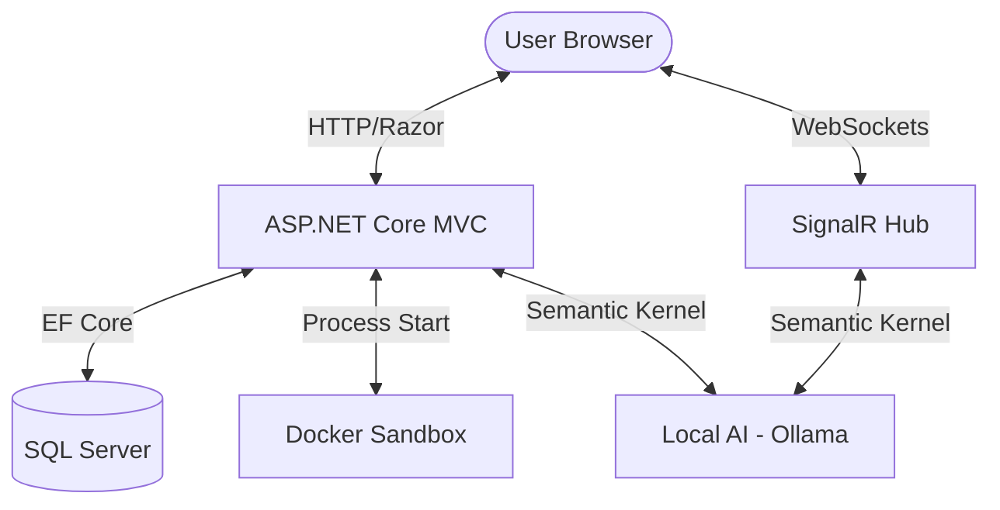
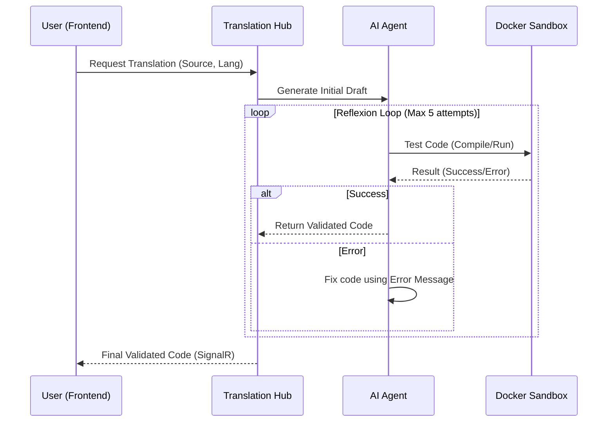
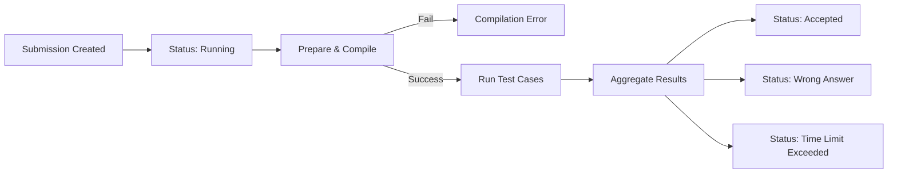

# System Architecture & Workflows: JustBigO-Fun

This document fulfills the requirement for Part B (Diagrams) of the MDS project.

## 1. High-Level System Architecture

The following diagram illustrates the components of the JustBigO-Fun platform and how they interact.

## 2. AI Code Translation Workflow (with Reflexion Loop)

This workflow describes how the system ensures AI-generated code is compilable before showing it to the user.

## 3. Submission Evaluation Workflow

