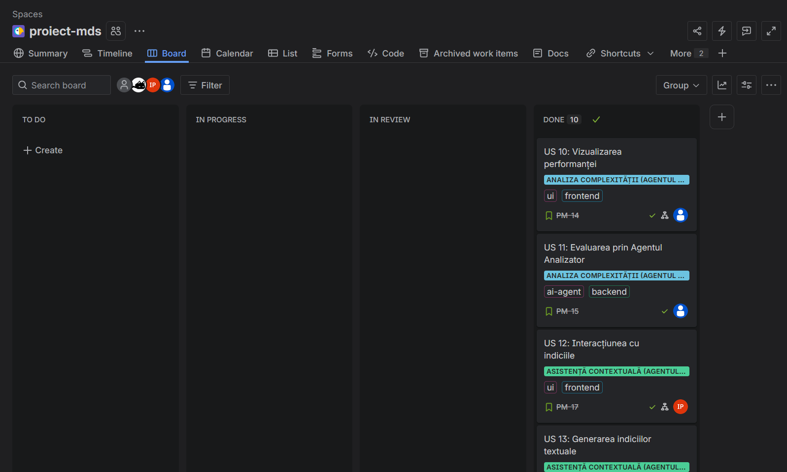
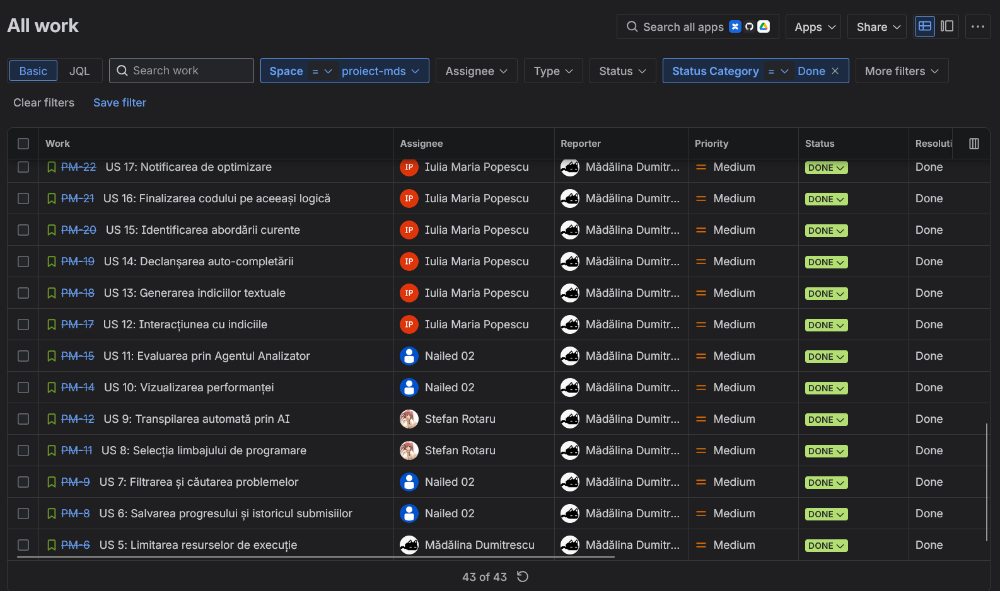

# JustBigO-Fun

JustBigO-Fun is an ASP.NET Core 9.0 MVC platform for algorithmic challenges, inspired by sites like LeetCode.

> 🎥 **Demo (screencast):** https://youtu.be/4bKce7Ch55Y

> 📄 The application's technical documentation (features, tech stack, run instructions) is in the **[Project Documentation](#project-documentation)** section at the end of this README.

---

## MDS Evaluation — AI-Driven Software Development Process (Component B)

This section maps each evaluation-rubric item to the corresponding artifacts and evidence in the repository. **Every item below involved the use of AI tools** (Gemini web, Cursor, Gemini CLI, Claude Code) — details in the [dedicated report](./docs/AI_USAGE_REPORT.md).

### 1. User stories (min. 10) & backlog creation — 2 pts
The user stories and backlog were created and managed in **Jira**, formulated and refined with AI (Gemini web) in the standard format ("As a user, I want… so that…"), together with their acceptance criteria.

**Jira board (screenshots):**





### 2. Diagrams (UML, component architecture, workflows) — 1 pt
The architecture, component, and workflow diagrams (e.g., the Reflexion loop, the sandbox execution flow) were generated and clarified with AI assistance.

- 📐 **Diagrams:** [`docs/DIAGRAMS.md`](./docs/DIAGRAMS.md)

### 3. Source control with git (branching, merge/rebase, pull requests, min. 5 commits/student) — 1 pt
Development was done on feature branches (`feature/generic-executor-metrics`, `fix/admin-area-overhaul`, `Transpilare`, `Indicii_US12_US13`, etc.), with merges, conflict resolution, and pull requests (#4–#19). AI was used to draft commit/PR messages and to resolve merge conflicts.

- 🔗 **Pull requests:** [PRs link](https://github.com/iuliahappy/JustBigO-Fun---Software-Development-Methodologies/pulls)
- 🔗 **Commit history:** [commits link](https://github.com/iuliahappy/JustBigO-Fun---Software-Development-Methodologies/commits/main/)

### 4. Automated tests (including agent evals) — 2 pts
The test suite in [`JustBigO(Fun).Tests/`](./JustBigO(Fun).Tests/) covers Controllers, Models, Hubs, and Services. It includes **agent evals** (`AI/CodeTranslatorAgentTests.cs`, `GeminiHintGeneratorTests.cs`, `GeminiRefactoringSuggestionGeneratorTests.cs`) that verify the structural integrity of AI-generated responses.

- 🧪 **Tests:** [`JustBigO(Fun).Tests/`](./JustBigO(Fun).Tests/)

### 5. Bug reporting and resolution via pull request — 1 pt
Real bugs identified and fixed via PR with AI assistance (diagnosis + fix), e.g.: "No redirect to login page" and "Grey text on dark background" (PR #17), fixing tests after resource-limit changes, and stopping the AI query after a timeout.

- 🐛 **Bug + fix (PR):** [bug/PR link](https://github.com/iuliahappy/JustBigO-Fun---Software-Development-Methodologies/issues?q=is%3Aissue%20state%3Aclosed)

### 6. CI/CD pipeline — 1 pt
The pipeline is configured in GitHub Actions and was generated with AI based on the project structure:
- **CI** (`build` job, runs on every push/PR): restore → build → run tests on .NET 9.
- **CD** (`publish` job, runs only on push to `main`, after CI passes): `dotnet publish` in Release mode and uploads the deployable build as a downloadable artifact.

- ⚙️ **Workflow:** [`.github/workflows/dotnet-ci.yml`](./.github/workflows/dotnet-ci.yml)

### 7. Report on the use of AI tools — 2 pts
A detailed report on the AI tools used by each team member and across each development phase.

- 📄 **Report:** [`docs/AI_USAGE_REPORT.md`](./docs/AI_USAGE_REPORT.md)

---

## Project Documentation

It provides a full-stack environment for users to browse coding problems, submit solutions, and have them validated against test cases.

### Key Features

- **Problem Library**: Browse a collection of algorithmic challenges with difficulty levels, tags, and detailed descriptions.
- **Solution Submission**: Submit C#, Python, Java, and C++ code for evaluation.
- **AI Transpiler & Mentor**: Features an integrated local AI Agent (Llama 3.2) that can seamlessly translate code between languages and provide hints. The AI uses an autonomous "Reflexion" loop to pre-compile and fix its own code before displaying it.
- **Automated Testing**: Integrated Docker-based code execution sandbox that runs user submissions and AI drafts against predefined test cases in isolated environments.
- **Admin Dashboard**: Secure area for managing problems, including CRUD operations and batch uploading test cases (`.in`/`.out` files).
- **Identity & RBAC**: Complete authentication system with role-based access control for users and administrators.

### Tech Stack

- **Backend**: .NET 9.0, ASP.NET Core MVC, C#, SignalR
- **Database**: SQL Server with Entity Framework Core
- **Authentication**: ASP.NET Core Identity
- **Containerization**: Docker (Code Execution Sandbox)
- **Local AI Engine**: Semantic Kernel & Ollama (Llama 3.2)
- **Frontend**: Razor Views, Bootstrap, Vanilla CSS, Monaco Editor

### Getting Started

#### Prerequisites

To run this project locally, you must have the following installed and running:
- [.NET 9 SDK](https://dotnet.microsoft.com/download/dotnet/9.0)
- [SQL Server](https://www.microsoft.com/en-us/sql-server/sql-server-downloads) (LocalDB supported)
- [Docker Desktop](https://www.docker.com/products/docker-desktop) (**Must be running** in the background)
- [Ollama](https://ollama.com/) (**Must be installed** for the local AI agent)

#### Setup Instructions

1. **Clone the repository**:
   ```bash
   git clone [https://github.com/your-username/JustBigO-Fun.git](https://github.com/your-username/JustBigO-Fun.git)
   cd JustBigO-Fun
   ```
   

2. **Build the Docker Execution Sandbox**:
   The application requires a specific Docker image to compile user and AI code. Ensure Docker Desktop is running, then execute this command in the project root:
   ```bash
   docker build -f Runner.Dockerfile -t justbigo-runner:latest .
   ```

3. **Download the AI Model**:
   The AI transpilation engine relies on the Llama 3.2 model. Run this command to download it to your local machine (this may take a few minutes depending on your internet connection):
   ```bash
   ollama run llama3.2
   ```
   *(Note: You can close the Ollama chat prompt once the download finishes, but the Ollama app must remain running in your system tray).*

4. **Configure Database**:
   Update the connection string in `JustBigO(Fun)/appsettings.json` if you are not using the default LocalDB instance.

5. **Restore & Run**:
   ```bash
   dotnet restore
   dotnet run --project "JustBigO(Fun)"
   ```
   *Note: Database migrations and initial data seeding (Problems & Admin user) occur automatically on the first run.*

### Default Credentials

- **Admin Email**: `admin@justbigofun.local`
- **Admin Password**: `Admin123!`

### Project Structure

- `JustBigO(Fun)/Controllers/`: MVC controllers including a dedicated `Admin` area for problem management.
- `JustBigO(Fun)/Hubs/`: SignalR hubs for real-time AI code streaming.
- `JustBigO(Fun)/Models/`: Domain entities like `Problem`, `Submission`, and `ProblemTest`.
- `JustBigO(Fun)/Services/`: Business logic, specifically the `ICodeExecutor` (Docker Sandbox) and `ICodeTranslatorAgent` (AI).
- `JustBigO(Fun)/Data/`: EF Core context and seeders (`ProblemSeeder`, `AdminSeeder`).
- `JustBigO(Fun)/Views/`: Razor views for the public interface and administrative tools.

### Development Conventions

- **Surgical Updates**: Follow existing patterns for adding new features or fixing bugs.
- **Validation**: Use Data Annotations for model validation.
- **Security**: Decorate administrative actions with `[Authorize(Roles = AdminSeeder.AdminRole)]`.
- **Testing**: New features should be accompanied by verification logic.
